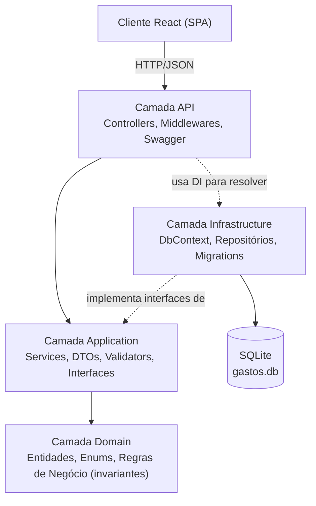
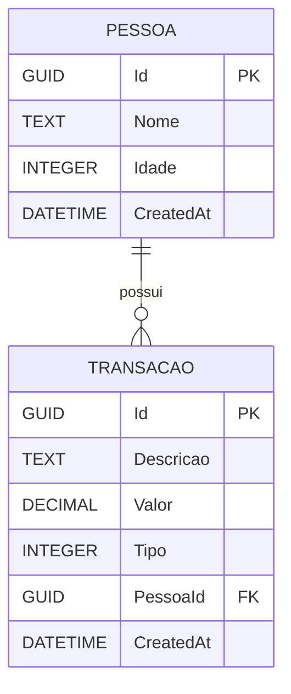
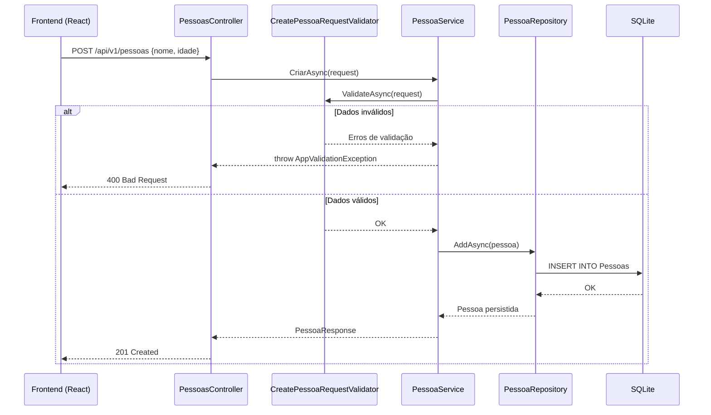
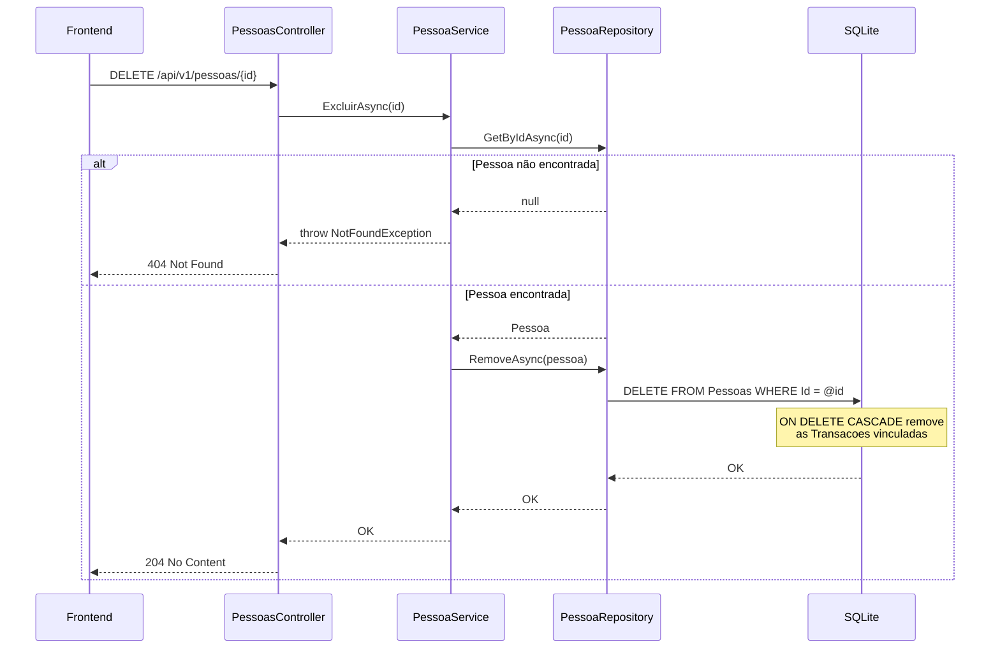
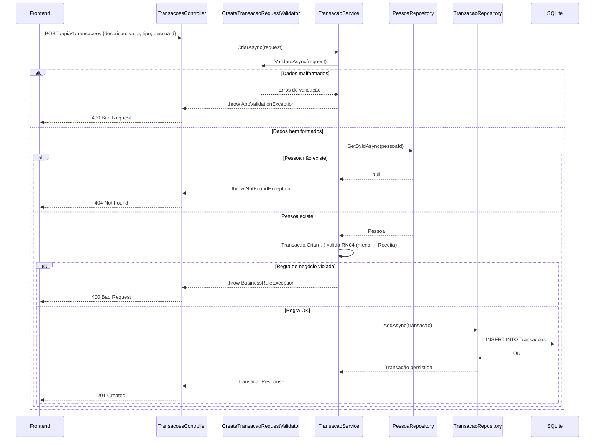
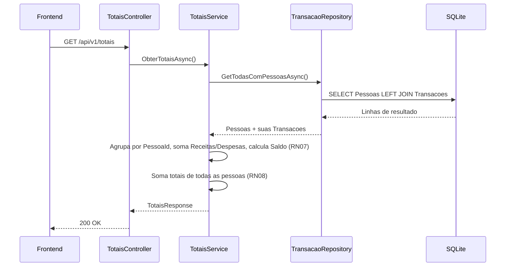

# SPEC Técnica — Sistema de Controle de Gastos Residenciais

| | |
|---|---|
| **Versão** | 1.0 |
| **Data** | 14/07/2026 |
| **Autor** | Kaike Vinicius Rodrigues de Melo |
| **Status** | Pronto para implementação |
| **Stack** | .NET 10 (LTS) + ASP.NET Core Web API + EF Core 10 · React + TypeScript · SQLite |

---

## Sumário

1. [Visão Geral](#1-visão-geral)
2. [Objetivos](#2-objetivos)
3. [Escopo](#3-escopo)
4. [Arquitetura](#4-arquitetura)
5. [Decisões Técnicas](#5-decisões-técnicas)
6. [Modelo de Dados](#6-modelo-de-dados)
7. [Regras de Negócio](#7-regras-de-negócio)
8. [Endpoints da API](#8-endpoints-da-api)
9. [Estrutura do Backend](#9-estrutura-do-backend)
10. [Estrutura do Frontend](#10-estrutura-do-frontend)
11. [Persistência](#11-persistência)
12. [Fluxos](#12-fluxos)
13. [Validações](#13-validações)
14. [Tratamento de Erros](#14-tratamento-de-erros)
15. [Estratégia de Testes](#15-estratégia-de-testes)
16. [Critérios de Aceite](#16-critérios-de-aceite)
17. [Considerações Finais](#17-considerações-finais)

---

## 1. Visão Geral

O **Sistema de Controle de Gastos Residenciais** é uma aplicação full-stack que permite a uma residência (ou grupo familiar) cadastrar as pessoas que a compõem e registrar as transações financeiras (receitas e despesas) associadas a cada uma delas, consultando em seguida um resumo consolidado de saldo por pessoa e um saldo geral da residência.

O sistema é composto por:

- Uma **API REST** (.NET 10 / ASP.NET Core) responsável por regras de negócio, persistência e exposição dos dados.
- Um **frontend web** (React + TypeScript) responsável pela interface de cadastro e consulta.
- Uma **base de dados SQLite** embarcada, garantindo persistência dos dados entre execuções sem exigir infraestrutura externa.

Este documento é a fonte única de verdade para a implementação: toda decisão de arquitetura, modelagem, contrato de API e regra de negócio necessária para o desenvolvimento está registrada aqui, para que a equipe implemente sem precisar tomar decisões estruturais por conta própria.

---

## 2. Objetivos

- Permitir o cadastro e a listagem de pessoas da residência.
- Permitir o cadastro e a listagem de transações financeiras (receitas e despesas) vinculadas a uma pessoa.
- Impedir o cadastro de receitas para pessoas menores de 18 anos, permitindo apenas despesas.
- Exibir totais de receitas, despesas e saldo por pessoa, além do total geral da residência.
- Garantir que a exclusão de uma pessoa remova automaticamente suas transações (integridade referencial).
- Entregar um código limpo, testável, em camadas, seguindo princípios de Clean Code e SOLID.
- Persistir os dados em disco, sobrevivendo a reinicializações da aplicação.

---

## 3. Escopo

### 3.1 Dentro do escopo (MVP)

- CRUD parcial de Pessoa: **criar**, **listar**, **excluir** (sem edição, conforme especificado).
- CRUD parcial de Transação: **criar**, **listar** (sem edição/exclusão, conforme especificado).
- Endpoint de totais consolidados (por pessoa + geral).
- Validações de negócio (idade mínima para receita, existência de pessoa, valores positivos).
- Documentação via Swagger/OpenAPI.
- Persistência local via SQLite.

### 3.2 Fora do escopo (explicitamente não implementado nesta versão)

- Autenticação/autorização de usuários (sistema de uso doméstico, single-tenant, sem login).
- Edição de pessoas e transações.
- Exclusão de transações.
- Categorização de despesas (ex.: "Alimentação", "Transporte").
- Suporte a múltiplas moedas.
- Paginação e filtros avançados (podem ser adicionados futuramente — ver seção 17).

---

## 4. Arquitetura

### 4.1 Estilo arquitetural

O backend adota uma **Clean Architecture simplificada** (também chamada de "Arquitetura em Camadas com Domínio no Centro"), separando o sistema em 4 projetos com dependências unidirecionais: `API → Application → Domain` e `Infrastructure → Application/Domain`.



**Por que essa escolha?**

| Alternativa considerada | Motivo da não adoção |
|---|---|
| Arquitetura monolítica simples (Controllers + DbContext direto) | Mistura regra de negócio com infraestrutura, dificulta testes unitários e viola SRP; aceitável só para protótipos descartáveis. |
| CQRS + MediatR | Adiciona uma camada de indireção (commands/queries/handlers) cujo benefício só se paga em sistemas com múltiplos casos de uso complexos ou necessidade de escalar leitura/escrita separadamente. Para 3 casos de uso simples, é over-engineering. |
| Clean Architecture completa com Value Objects ricos e Domain Events | Ganho marginal para este domínio (poucas entidades, poucas regras). Optou-se por uma versão enxuta, mantendo o princípio (regra de negócio isolada em `Domain`), sem o custo de abstração extra. |

A escolha final — **Clean Architecture simplificada, com padrão Repository + Service** — equilibra separação de responsabilidades, testabilidade e simplicidade de manutenção, sem introduzir complexidade desnecessária para o tamanho do domínio.

### 4.2 Responsabilidade de cada camada

| Camada | Responsabilidade | Não deve conter |
|---|---|---|
| **Domain** | Entidades (`Pessoa`, `Transacao`), enums, invariantes de negócio que protegem a integridade do próprio objeto | Referências a EF Core, ASP.NET, DTOs |
| **Application** | Casos de uso (Services), DTOs, contratos de repositório (interfaces), validação de entrada (FluentValidation), exceções de aplicação | Acesso direto a banco de dados, detalhes de HTTP |
| **Infrastructure** | Implementação dos repositórios, `DbContext`, mapeamento EF Core (Fluent API), Migrations | Regra de negócio |
| **API** | Controllers (HTTP), Middlewares, configuração de DI, Swagger, versionamento | Regra de negócio, acesso direto ao banco |

### 4.3 Fluxo de uma requisição típica

`Cliente → Controller → Validator → Service → Repository (interface) → Repository (implementação) → DbContext → SQLite`, com o caminho de volta convertendo a entidade de domínio em um DTO de resposta.

---

## 5. Decisões Técnicas

| Decisão | Escolha | Justificativa | Trade-off aceito |
|---|---|---|---|
| Versão do .NET | **.NET 10 (LTS)**, suportado até novembro/2028 | É a versão LTS mais recente no momento da elaboração desta SPEC (lançada em novembro/2025); .NET 8 e 9 encerram suporte em novembro/2026 | Requer SDK recente instalado no ambiente de desenvolvimento |
| Linguagem | C# 14 | Acompanha o .NET 10; sem motivo para usar versão anterior | — |
| Identificador de entidades | `Guid` gerado via `Guid.CreateVersion7()` (UUID v7, disponível desde o .NET 9) | UUID evita colisão em cenários distribuídos e facilita geração no cliente; a variante v7 é ordenável por tempo, reduzindo fragmentação de índice em relação ao `Guid.NewGuid()` tradicional | Ocupa mais espaço que um `int` (16 bytes vs 4); irrelevante para o volume de dados esperado (uso doméstico) |
| Banco de dados | **SQLite** via EF Core | Ver seção 11 (Persistência) | Não recomendado para alta concorrência — aceitável, pois é um sistema de uso residencial/single-user |
| ORM | Entity Framework Core 10 | Padrão de mercado no ecossistema .NET, produtividade em migrations e LINQ | Overhead de abstração desprezível para o volume de dados do domínio |
| Padrão de acesso a dados | Repository + Service (sem CQRS/MediatR) | Ver seção 4.1 | Menos "na moda", porém mais direto e legível para este escopo |
| Validação de entrada | **FluentValidation** | Separa regras de validação dos DTOs, é testável isoladamente e mais expressivo que Data Annotations para regras compostas | Dependência externa adicional (leve e amplamente adotada) |
| Invocação da validação | Manual, dentro do Service (`IValidator<T>.ValidateAsync`) | O pacote `FluentValidation.AspNetCore` (auto-validação via filtro MVC) foi descontinuado pelo autor da biblioteca; a invocação manual é a prática atual recomendada | Um pouco mais de código boilerplate por endpoint, mitigado por um método utilitário compartilhado |
| Serialização de enum | `Tipo` (Receita/Despesa) trafega como **string** no JSON (`JsonStringEnumConverter`) | Contratos de API mais legíveis (`"Receita"` em vez de `1`) e menos propensos a erro de integração no frontend | Payload ligeiramente maior (irrelevante) |
| Logging | `ILogger<T>` (abstração padrão do .NET) com **Serilog** como provedor, saída em console + arquivo rotativo | Logging estruturado facilita depuração e auditoria sem acoplar o código de negócio a uma biblioteca específica (código usa apenas `ILogger<T>`) | Configuração adicional no `Program.cs` |
| Versionamento de API | Prefixo de rota `api/v1/...` | Simples, sem dependência extra, suficiente para uma única versão ativa; migração para o pacote `Asp.Versioning.Http` é trivial se surgir uma v2 | Não há negociação de versão via header — aceitável para o escopo atual |
| Tratamento de erros | Middleware global de exceções + exceções de domínio tipadas (`NotFoundException`, `BusinessRuleException`, `AppValidationException`) | Centraliza a tradução de exceção → resposta HTTP padronizada, evitando `try/catch` repetido em cada controller | — |
| Documentação de API | Swagger/OpenAPI via `Microsoft.AspNetCore.OpenApi` + Swashbuckle UI | Padrão de mercado, gera contrato navegável e testável | — |
| Gerenciamento de estado (frontend) | **TanStack Query (React Query)** para estado de servidor + `useState`/`useReducer` local para formulários | O estado da aplicação é majoritariamente "dados vindos da API"; React Query resolve cache, loading, erro e revalidação sem precisar de Redux | Nova dependência, porém reduz código boilerplate de chamadas HTTP manuais |
| Cliente HTTP (frontend) | `axios` com instância única e interceptor de erros | API de alto nível mais ergonômica que `fetch` puro para tratamento de erros centralizado | — |
| Roteamento (frontend) | `react-router-dom` | Padrão de mercado para SPAs em React | — |

---

## 6. Modelo de Dados

### 6.1 Diagrama Entidade-Relacionamento



### 6.2 Tabela `Pessoas`

| Campo | Tipo (C#) | Tipo (SQLite) | Obrigatório | Constraint |
|---|---|---|---|---|
| Id | `Guid` | `TEXT` (36) | Sim | PK |
| Nome | `string` | `TEXT` | Sim | `MaxLength(100)`, não vazio |
| Idade | `int` | `INTEGER` | Sim | `>= 0 AND <= 130` (CHECK) |
| CreatedAt | `DateTime` (UTC) | `TEXT` | Sim | Default `CURRENT_TIMESTAMP`, gerado pela aplicação |

### 6.3 Tabela `Transacoes`

| Campo | Tipo (C#) | Tipo (SQLite) | Obrigatório | Constraint |
|---|---|---|---|---|
| Id | `Guid` | `TEXT` (36) | Sim | PK |
| Descricao | `string` | `TEXT` | Sim | `MaxLength(200)`, não vazia |
| Valor | `decimal(18,2)` | `NUMERIC` | Sim | `> 0` (CHECK) |
| Tipo | `enum TipoTransacao` (1=Receita, 2=Despesa) | `INTEGER` | Sim | Valor dentro do enum (CHECK) |
| PessoaId | `Guid` | `TEXT` (36) | Sim | FK → `Pessoas.Id`, `ON DELETE CASCADE` |
| CreatedAt | `DateTime` (UTC) | `TEXT` | Sim | Default `CURRENT_TIMESTAMP` |

### 6.4 Relacionamentos, chaves e índices

- **Relacionamento**: `Pessoa (1) — (N) Transacao`, obrigatório (toda transação pertence a exatamente uma pessoa).
- **Chave estrangeira**: `Transacoes.PessoaId → Pessoas.Id`, com `DeleteBehavior.Cascade` configurado no EF Core (implementa a regra de exclusão em cascata do item 7.1).
- **Índices**:
  - Índice não-clusterizado em `Transacoes.PessoaId` — acelera o `JOIN`/`GroupBy` usado no endpoint de totais (seção 8.6), que é o endpoint com maior custo de leitura do sistema.
  - Chave primária (`Id`) já é indexada por padrão em ambas as tabelas.
- **Constraints de domínio aplicadas via EF Core Fluent API** (`HasCheckConstraint`): `Idade >= 0`, `Valor > 0`. Isso garante integridade mesmo que, no futuro, outra aplicação escreva diretamente no banco.

---

## 7. Regras de Negócio

| # | Regra | Onde é validada | Consequência se violada |
|---|---|---|---|
| RN01 | O `Id` de `Pessoa` e `Transacao` é gerado automaticamente pelo servidor (`Guid.CreateVersion7()`), nunca recebido do cliente | Domain (construtor/factory da entidade) | Campo `id` no request é ignorado, se enviado |
| RN02 | Ao excluir uma `Pessoa`, todas as suas `Transacoes` são removidas automaticamente (cascade delete) | Infrastructure (configuração EF Core `OnDelete(DeleteBehavior.Cascade)`) | N/A — comportamento automático do banco |
| RN03 | Toda `Transacao` deve referenciar uma `Pessoa` existente | Application (`TransacaoService`, antes de persistir) | 404 Not Found |
| RN04 | Pessoas com `Idade < 18` só podem ter transações do tipo `Despesa` | Domain (`Transacao.Criar(...)`, invariante de fábrica) **e** Application (checagem prévia no service, para retornar erro de negócio claro) | 400 Bad Request |
| RN05 | O valor (`Valor`) de uma transação deve ser positivo (`> 0`) | Application (FluentValidation) + Domain (CHECK constraint) | 400 Bad Request |
| RN06 | Nome da pessoa e descrição da transação são obrigatórios e não podem ser vazios/whitespace | Application (FluentValidation) | 400 Bad Request |
| RN07 | Totais por pessoa = soma de receitas, soma de despesas e saldo (`Receitas - Despesas`) | Application (`TotaisService`) | N/A — cálculo, não validação |
| RN08 | Total geral = soma dos totais individuais de todas as pessoas | Application (`TotaisService`) | N/A — cálculo, não validação |
| RN09 | Toda exceção não tratada deve resultar em resposta padronizada, nunca em stack trace exposto ao cliente | API (middleware global de exceção) | 500 Internal Server Error, log registrado |

> **Nota de design (defesa em profundidade):** a RN04 é validada tanto na camada de `Domain` (a entidade `Transacao` não pode ser instanciada em estado inválido, garantindo que a regra vale mesmo se algum código futuro chamar o construtor diretamente) quanto na camada de `Application` (para produzir uma mensagem de erro amigável antes mesmo de tentar construir o objeto). Essa duplicação é intencional e não viola DRY — são duas camadas de proteção com propósitos distintos: uma garante *correção do modelo*, a outra garante *boa experiência de erro para o cliente da API*.

---

## 8. Endpoints da API

Prefixo base: `/api/v1`

| Método | Rota | Descrição |
|---|---|---|
| `POST` | `/api/v1/pessoas` | Cria uma pessoa |
| `GET` | `/api/v1/pessoas` | Lista todas as pessoas |
| `DELETE` | `/api/v1/pessoas/{id}` | Exclui uma pessoa (e suas transações) |
| `POST` | `/api/v1/transacoes` | Cria uma transação |
| `GET` | `/api/v1/transacoes` | Lista todas as transações |
| `GET` | `/api/v1/totais` | Retorna totais por pessoa e geral |

### 8.1 `POST /api/v1/pessoas`

Cria uma nova pessoa.

**Request:**
```json
{
  "nome": "Maria Silva",
  "idade": 34
}
```

**Response `201 Created`:**
```json
{
  "id": "01942a3e-2f0a-7b21-8c2e-3a9d9f0a1b2c",
  "nome": "Maria Silva",
  "idade": 34
}
```
Header `Location: /api/v1/pessoas/01942a3e-2f0a-7b21-8c2e-3a9d9f0a1b2c`

**Erros possíveis:**

| Status | Cenário | Corpo |
|---|---|---|
| `400` | `nome` vazio ou `idade` ausente/negativa/> 130 | Ver seção 14 |

---

### 8.2 `GET /api/v1/pessoas`

Lista todas as pessoas cadastradas.

**Response `200 OK`:**
```json
[
  {
    "id": "01942a3e-2f0a-7b21-8c2e-3a9d9f0a1b2c",
    "nome": "Maria Silva",
    "idade": 34
  },
  {
    "id": "01942a3f-9c11-7e45-9a10-7d3c2f4b8e91",
    "nome": "Lucas Silva",
    "idade": 15
  }
]
```
Se não houver pessoas cadastradas, retorna `[]` com status `200`.

---

### 8.3 `DELETE /api/v1/pessoas/{id}`

Exclui uma pessoa e, em cascata, todas as suas transações.

**Response `204 No Content`** (sem corpo)

**Erros possíveis:**

| Status | Cenário |
|---|---|
| `404` | Pessoa com o `id` informado não existe |

---

### 8.4 `POST /api/v1/transacoes`

Cria uma nova transação vinculada a uma pessoa.

**Request:**
```json
{
  "descricao": "Salário mensal",
  "valor": 3500.00,
  "tipo": "Receita",
  "pessoaId": "01942a3e-2f0a-7b21-8c2e-3a9d9f0a1b2c"
}
```

**Response `201 Created`:**
```json
{
  "id": "01942a41-6d20-7c33-b210-4e7f9a0c5d12",
  "descricao": "Salário mensal",
  "valor": 3500.00,
  "tipo": "Receita",
  "pessoaId": "01942a3e-2f0a-7b21-8c2e-3a9d9f0a1b2c",
  "pessoaNome": "Maria Silva"
}
```
> `pessoaNome` é incluído na resposta como conveniência para o frontend evitar um segundo lookup ao renderizar a lista de transações.

**Erros possíveis:**

| Status | Cenário | Exemplo de mensagem |
|---|---|---|
| `400` | `descricao` vazia, `valor <= 0`, `tipo` inválido/ausente, `pessoaId` ausente | "O valor da transação deve ser maior que zero." |
| `400` | Regra de negócio violada: pessoa menor de idade recebendo `Receita` | "Pessoas menores de 18 anos só podem ter transações do tipo Despesa." |
| `404` | `pessoaId` não corresponde a nenhuma pessoa cadastrada | "Pessoa não encontrada." |

---

### 8.5 `GET /api/v1/transacoes`

Lista todas as transações cadastradas.

**Response `200 OK`:**
```json
[
  {
    "id": "01942a41-6d20-7c33-b210-4e7f9a0c5d12",
    "descricao": "Salário mensal",
    "valor": 3500.00,
    "tipo": "Receita",
    "pessoaId": "01942a3e-2f0a-7b21-8c2e-3a9d9f0a1b2c",
    "pessoaNome": "Maria Silva"
  },
  {
    "id": "01942a42-8a15-7f10-9c33-1b4e6d7a2f05",
    "descricao": "Mesada",
    "valor": 100.00,
    "tipo": "Despesa",
    "pessoaId": "01942a3f-9c11-7e45-9a10-7d3c2f4b8e91",
    "pessoaNome": "Lucas Silva"
  }
]
```

---

### 8.6 `GET /api/v1/totais`

Retorna o resumo financeiro por pessoa e o total geral da residência.

**Response `200 OK`:**
```json
{
  "pessoas": [
    {
      "pessoaId": "01942a3e-2f0a-7b21-8c2e-3a9d9f0a1b2c",
      "nome": "Maria Silva",
      "totalReceitas": 3500.00,
      "totalDespesas": 0.00,
      "saldo": 3500.00
    },
    {
      "pessoaId": "01942a3f-9c11-7e45-9a10-7d3c2f4b8e91",
      "nome": "Lucas Silva",
      "totalReceitas": 0.00,
      "totalDespesas": 100.00,
      "saldo": -100.00
    }
  ],
  "totalGeralReceitas": 3500.00,
  "totalGeralDespesas": 100.00,
  "saldoLiquidoGeral": 3400.00
}
```
Pessoas sem nenhuma transação aparecem na lista com todos os totais em `0.00`.

---

## 9. Estrutura do Backend

### 9.1 Organização da solução

```text
GastosResidenciais.sln
src/
 ├── GastosResidenciais.API/
 │    ├── Controllers/
 │    │    ├── PessoasController.cs
 │    │    ├── TransacoesController.cs
 │    │    └── TotaisController.cs
 │    ├── Middlewares/
 │    │    └── ExceptionHandlingMiddleware.cs
 │    ├── Extensions/
 │    │    └── ServiceCollectionExtensions.cs   // DI de Application + Infrastructure
 │    ├── Program.cs
 │    ├── appsettings.json
 │    └── appsettings.Development.json
 │
 ├── GastosResidenciais.Application/
 │    ├── DTOs/
 │    │    ├── Pessoas/ (CreatePessoaRequest, PessoaResponse)
 │    │    ├── Transacoes/ (CreateTransacaoRequest, TransacaoResponse)
 │    │    └── Totais/ (TotaisResponse, TotalPorPessoaResponse)
 │    ├── Interfaces/
 │    │    ├── IPessoaService.cs / ITransacaoService.cs / ITotaisService.cs
 │    │    └── IPessoaRepository.cs / ITransacaoRepository.cs
 │    ├── Services/
 │    │    ├── PessoaService.cs
 │    │    ├── TransacaoService.cs
 │    │    └── TotaisService.cs
 │    ├── Validators/
 │    │    ├── CreatePessoaRequestValidator.cs
 │    │    └── CreateTransacaoRequestValidator.cs
 │    └── Exceptions/
 │         ├── NotFoundException.cs
 │         ├── BusinessRuleException.cs
 │         └── AppValidationException.cs
 │
 ├── GastosResidenciais.Domain/
 │    ├── Entities/
 │    │    ├── Pessoa.cs
 │    │    └── Transacao.cs
 │    └── Enums/
 │         └── TipoTransacao.cs
 │
 └── GastosResidenciais.Infrastructure/
      ├── Persistence/
      │    ├── AppDbContext.cs
      │    ├── Configurations/
      │    │    ├── PessoaConfiguration.cs
      │    │    └── TransacaoConfiguration.cs
      │    └── Migrations/  (geradas via `dotnet ef migrations add`)
      └── Repositories/
           ├── PessoaRepository.cs
           └── TransacaoRepository.cs

tests/
 ├── GastosResidenciais.UnitTests/
 │    ├── Services/
 │    ├── Domain/
 │    └── Validators/
 └── GastosResidenciais.IntegrationTests/
      └── Controllers/
```

### 9.2 Domain — Entidades

Regras de negócio críticas ficam encapsuladas na própria entidade, via factory method, para que seja impossível construir um objeto em estado inválido.

```csharp
// Domain/Entities/Transacao.cs
public class Transacao
{
    public Guid Id { get; private set; }
    public string Descricao { get; private set; }
    public decimal Valor { get; private set; }
    public TipoTransacao Tipo { get; private set; }
    public Guid PessoaId { get; private set; }
    public DateTime CreatedAt { get; private set; }

    private Transacao() { } // uso do EF Core

    public static Transacao Criar(string descricao, decimal valor, TipoTransacao tipo, Pessoa pessoa)
    {
        if (string.IsNullOrWhiteSpace(descricao))
            throw new ArgumentException("Descrição é obrigatória.", nameof(descricao));

        if (valor <= 0)
            throw new ArgumentException("Valor deve ser maior que zero.", nameof(valor));

        if (pessoa.Idade < 18 && tipo == TipoTransacao.Receita)
            throw new BusinessRuleException(
                "Pessoas menores de 18 anos só podem ter transações do tipo Despesa.");

        return new Transacao
        {
            Id = Guid.CreateVersion7(),
            Descricao = descricao.Trim(),
            Valor = valor,
            Tipo = tipo,
            PessoaId = pessoa.Id,
            CreatedAt = DateTime.UtcNow
        };
    }
}
```

> **Sobre Value Objects:** avaliou-se criar um Value Object `Dinheiro` (encapsulando `decimal` + regra de positividade) e um `NomePessoa`. Optou-se por **não** introduzi-los nesta versão: o ganho de expressividade é pequeno frente ao número reduzido de regras associadas a esses campos, e a validação já é garantida tanto no `Domain` quanto na `Application`. Fica documentado como possível refino futuro (seção 17) caso o domínio cresça (ex.: suporte a múltiplas moedas tornaria `Dinheiro` valioso).

### 9.3 Application — Services

Cada `Service` orquestra: validação → busca de dependências → aplicação de regra → persistência → mapeamento para DTO. Exemplo:

```csharp
public class TransacaoService : ITransacaoService
{
    private readonly ITransacaoRepository _transacaoRepository;
    private readonly IPessoaRepository _pessoaRepository;
    private readonly IValidator<CreateTransacaoRequest> _validator;

    public async Task<TransacaoResponse> CriarAsync(CreateTransacaoRequest request)
    {
        var validationResult = await _validator.ValidateAsync(request);
        if (!validationResult.IsValid)
            throw new AppValidationException(validationResult.Errors);

        var pessoa = await _pessoaRepository.GetByIdAsync(request.PessoaId)
            ?? throw new NotFoundException("Pessoa não encontrada.");

        var transacao = Transacao.Criar(request.Descricao, request.Valor, request.Tipo, pessoa);

        await _transacaoRepository.AddAsync(transacao);

        return new TransacaoResponse(transacao, pessoa.Nome);
    }
}
```

### 9.4 Infrastructure — DbContext e Repositórios

```csharp
// Infrastructure/Persistence/AppDbContext.cs
public class AppDbContext : DbContext
{
    public DbSet<Pessoa> Pessoas => Set<Pessoa>();
    public DbSet<Transacao> Transacoes => Set<Transacao>();

    public AppDbContext(DbContextOptions<AppDbContext> options) : base(options) { }

    protected override void OnModelCreating(ModelBuilder modelBuilder)
    {
        modelBuilder.ApplyConfigurationsFromAssembly(typeof(AppDbContext).Assembly);
    }
}
```

```csharp
// Infrastructure/Persistence/Configurations/TransacaoConfiguration.cs
public class TransacaoConfiguration : IEntityTypeConfiguration<Transacao>
{
    public void Configure(EntityTypeBuilder<Transacao> builder)
    {
        builder.HasKey(t => t.Id);
        builder.Property(t => t.Descricao).IsRequired().HasMaxLength(200);
        builder.Property(t => t.Valor).HasColumnType("NUMERIC(18,2)");
        builder.Property(t => t.Tipo).HasConversion<int>();

        builder.HasIndex(t => t.PessoaId);

        builder.HasOne<Pessoa>()
            .WithMany()
            .HasForeignKey(t => t.PessoaId)
            .OnDelete(DeleteBehavior.Cascade); // RN02 — exclusão em cascata

        builder.ToTable(t => t.HasCheckConstraint("CK_Transacao_Valor", "Valor > 0"));
    }
}
```

Repositórios são implementações finas sobre o `DbContext` (sem lógica de negócio), expondo apenas os métodos necessários pelas interfaces definidas em `Application/Interfaces` (Dependency Inversion — a camada de aplicação não conhece o EF Core).

### 9.5 API — Controller, Middleware e Program.cs

```csharp
// API/Controllers/TransacoesController.cs
[ApiController]
[Route("api/v1/transacoes")]
public class TransacoesController : ControllerBase
{
    private readonly ITransacaoService _service;

    [HttpPost]
    public async Task<ActionResult<TransacaoResponse>> Criar(CreateTransacaoRequest request)
    {
        var response = await _service.CriarAsync(request);
        return CreatedAtAction(nameof(Listar), new { }, response);
    }

    [HttpGet]
    public async Task<ActionResult<IEnumerable<TransacaoResponse>>> Listar()
        => Ok(await _service.ListarAsync());
}
```

O **middleware de exceção** (registrado antes do roteamento no `Program.cs`) intercepta `NotFoundException`, `BusinessRuleException`, `AppValidationException` e qualquer exceção genérica, convertendo-as para o formato de erro padrão (seção 14).

`Program.cs` concentra: registro de DI (`AddScoped` para Services/Repositories), configuração do `DbContext` (connection string via `appsettings.json`), Swagger, Serilog, CORS (liberado para a origem do frontend em desenvolvimento) e a aplicação automática de migrations na inicialização (seção 11.3).

**`appsettings.json` (exemplo):**
```json
{
  "ConnectionStrings": {
    "DefaultConnection": "Data Source=gastos.db"
  },
  "Logging": {
    "LogLevel": { "Default": "Information", "Microsoft.EntityFrameworkCore": "Warning" }
  },
  "AllowedOrigins": ["http://localhost:5173"]
}
```

---

## 10. Estrutura do Frontend

### 10.1 Organização do projeto

```text
src/
 ├── components/
 │    ├── common/       (Button, Input, Select, Modal, Table, Spinner, EmptyState, ToastContainer)
 │    ├── pessoas/       (PessoaForm, PessoaList, PessoaListItem, ConfirmDeleteDialog)
 │    ├── transacoes/    (TransacaoForm, TransacaoList, TransacaoListItem, TipoBadge)
 │    └── totais/        (TotaisTable, TotalGeralCard)
 ├── pages/
 │    ├── PessoasPage.tsx
 │    ├── TransacoesPage.tsx
 │    └── TotaisPage.tsx
 ├── services/
 │    ├── api.ts               // instância axios + interceptors
 │    ├── pessoasService.ts
 │    ├── transacoesService.ts
 │    └── totaisService.ts
 ├── hooks/
 │    ├── usePessoas.ts         // useQuery + useMutation (React Query)
 │    ├── useTransacoes.ts
 │    └── useTotais.ts
 ├── types/
 │    ├── pessoa.ts
 │    ├── transacao.ts
 │    └── totais.ts
 ├── routes/
 │    └── AppRoutes.tsx
 ├── utils/
 │    ├── formatCurrency.ts     // Intl.NumberFormat('pt-BR', { style: 'currency', currency: 'BRL' })
 │    └── errorMessages.ts
 ├── App.tsx
 └── main.tsx
```

### 10.2 Páginas

| Página | Rota | Conteúdo |
|---|---|---|
| `PessoasPage` | `/pessoas` | Formulário de criação + tabela de listagem + ação de exclusão (com confirmação) |
| `TransacoesPage` | `/transacoes` | Formulário de criação (com `select` de pessoa) + tabela de listagem |
| `TotaisPage` | `/totais` | Tabela por pessoa (receitas/despesas/saldo) + card de totais gerais |

### 10.3 Principais componentes

- **`PessoaForm`**: campos `nome` (texto) e `idade` (numérico); validação client-side espelhando as regras da API antes do submit, para feedback imediato.
- **`TransacaoForm`**: campos `descricao`, `valor` (numérico, formatado como moeda), `tipo` (select Receita/Despesa) e `pessoaId` (select populado via `usePessoas`). Se a pessoa selecionada tiver `idade < 18`, a opção "Receita" é desabilitada no próprio `select`, evitando a tentativa de erro conhecida — mas o backend permanece a fonte de verdade da regra (RN04), garantindo que a UI não seja o único ponto de proteção.
- **`ConfirmDeleteDialog`**: modal de confirmação genérico, reutilizado ao excluir pessoa, avisando explicitamente que as transações vinculadas também serão removidas.
- **`TotaisTable`** / **`TotalGeralCard`**: apresentação somente leitura dos dados de `GET /api/v1/totais`.
- **`EmptyState`**: componente compartilhado exibido quando uma listagem retorna vazia (ex.: "Nenhuma pessoa cadastrada ainda").
- **`Spinner`** / **`Skeleton`**: indicadores de carregamento reutilizados em todas as páginas.

### 10.4 Gerenciamento de estado

- **Estado de servidor** (dados vindos da API): gerenciado por **React Query**, que cuida de cache, `isLoading`, `isError`, invalidação automática de cache após mutações (ex.: criar transação invalida a query de totais).
- **Estado local de formulário**: `useState` simples nos componentes de formulário; não há necessidade de uma biblioteca de formulários dado o baixo número de campos, mas `react-hook-form` é uma extensão futura aceitável se os formulários crescerem.
- Não há estado global compartilhado entre páginas não relacionado a servidor, portanto **Redux/Zustand não são necessários**.

### 10.5 Comunicação com a API

Toda chamada HTTP passa por `services/api.ts`, uma instância única do `axios` com `baseURL` configurada via variável de ambiente (`VITE_API_URL`) e um interceptor de resposta que:
1. Em caso de erro, extrai o corpo padronizado de erro (seção 14) e o repassa normalizado para quem chamou.
2. Loga o erro no console em ambiente de desenvolvimento.

### 10.6 Tratamento de erros e feedback visual

| Cenário | Comportamento na UI |
|---|---|
| Erro de validação (`400`) | Mensagens exibidas inline, abaixo do campo correspondente, usando o array `errors` da resposta |
| Recurso não encontrado (`404`) | Toast de erro genérico ("Pessoa não encontrada.") — cenário raro na prática, pois a UI já trabalha com dados atualizados via cache |
| Erro de servidor (`500`) | Toast de erro genérico ("Algo deu errado. Tente novamente.") sem detalhes técnicos expostos |
| Falha de rede | Toast indicando problema de conexão, com opção de nova tentativa |

### 10.7 Estados de carregamento e vazio

- Toda página que consome dados exibe um **skeleton/spinner** enquanto `isLoading === true`.
- Toda listagem vazia exibe o componente `EmptyState` com uma call-to-action apontando para o formulário de criação correspondente.
- Botões de submit ficam desabilitados e exibem um spinner interno durante `isPending` da mutação, prevenindo duplo envio.

---

## 11. Persistência

### 11.1 Banco escolhido: SQLite

### 11.2 Justificativa técnica

| Critério | Análise |
|---|---|
| Persistência entre execuções | Arquivo `gastos.db` em disco — atende diretamente ao requisito de sobreviver a reinicializações |
| Complexidade de infraestrutura | Zero instalação/configuração de servidor de banco — essencial para um sistema de uso residencial que deve rodar em qualquer máquina sem setup adicional |
| Suporte no EF Core | Provider oficial (`Microsoft.EntityFrameworkCore.Sqlite`), maduro e com suporte completo a Migrations |
| Concorrência | SQLite lida bem com múltiplos leitores e um único escritor por vez — mais que suficiente para o padrão de uso de uma residência (poucos usuários simultâneos) |
| Portabilidade | Arquivo único, fácil de fazer backup (copiar o arquivo) ou versionar para debug |

**Alternativas descartadas:**
- **SQL Server LocalDB**: exclusivo do Windows, exigiria Visual Studio/SQL Server Express instalado — reduz portabilidade sem trazer benefício relevante para este volume de dados.
- **PostgreSQL/SQL Server "completo"**: exigiria um servidor de banco rodando separadamente, infraestrutura desproporcional ao problema (uso doméstico, poucos usuários).

### 11.3 Configuração e estratégia de criação/migração do banco

- Connection string em `appsettings.json`: `Data Source=gastos.db` (arquivo criado no diretório de execução da API).
- Registro no DI: `services.AddDbContext<AppDbContext>(options => options.UseSqlite(connectionString));`
- **Migrations** geradas via CLI: `dotnet ef migrations add NomeDaMigration -p GastosResidenciais.Infrastructure -s GastosResidenciais.API`.
- **Criação/atualização do banco na inicialização**: no `Program.cs`, antes de `app.Run()`, executa-se `db.Database.Migrate()` dentro de um escopo de serviço. Essa abordagem (Migrate, e não `EnsureCreated`) foi escolhida porque:
  - `EnsureCreated()` não gera nem aplica migrations, dificultando evolução futura do schema.
  - `Migrate()` aplica automaticamente qualquer migration pendente, garantindo que o schema esteja sempre atualizado ao iniciar a aplicação — comportamento adequado para um sistema standalone sem pipeline de deploy dedicado a banco de dados.

```csharp
using var scope = app.Services.CreateScope();
var db = scope.ServiceProvider.GetRequiredService<AppDbContext>();
db.Database.Migrate();
```

---

## 12. Fluxos

### 12.1 Criar Pessoa



### 12.2 Excluir Pessoa



### 12.3 Criar Transação



### 12.4 Consultar Totais



---

## 13. Validações

| Campo | Regra | Mensagem de erro | Camada |
|---|---|---|---|
| `Pessoa.nome` | Obrigatório, não vazio/whitespace | "Nome é obrigatório." | FluentValidation (Application) |
| `Pessoa.nome` | Máximo 100 caracteres | "Nome deve ter no máximo 100 caracteres." | FluentValidation |
| `Pessoa.idade` | Obrigatório | "Idade é obrigatória." | FluentValidation |
| `Pessoa.idade` | `>= 0` e `<= 130` | "Idade deve estar entre 0 e 130." | FluentValidation + CHECK constraint |
| `Transacao.descricao` | Obrigatória, não vazia/whitespace | "Descrição é obrigatória." | FluentValidation |
| `Transacao.descricao` | Máximo 200 caracteres | "Descrição deve ter no máximo 200 caracteres." | FluentValidation |
| `Transacao.valor` | Obrigatório, `> 0` | "Valor deve ser maior que zero." | FluentValidation + CHECK constraint |
| `Transacao.tipo` | Obrigatório, deve ser `Receita` ou `Despesa` | "Tipo deve ser 'Receita' ou 'Despesa'." | FluentValidation |
| `Transacao.pessoaId` | Obrigatório | "Pessoa é obrigatória." | FluentValidation |
| `Transacao.pessoaId` | Deve corresponder a uma pessoa existente | "Pessoa não encontrada." | Application (`TransacaoService`) |
| `Transacao` (RN04) | Se `Pessoa.idade < 18`, `tipo` não pode ser `Receita` | "Pessoas menores de 18 anos só podem ter transações do tipo Despesa." | Domain (`Transacao.Criar`) |

---

## 14. Tratamento de Erros

### 14.1 Formato padrão de resposta de erro

Todas as respostas de erro seguem o mesmo contrato:

```json
{
  "message": "Pessoa não encontrada.",
  "errors": [],
  "status": 404
}
```

Para erros de validação com múltiplos campos:

```json
{
  "message": "Um ou mais campos são inválidos.",
  "errors": [
    "Nome é obrigatório.",
    "Idade deve estar entre 0 e 130."
  ],
  "status": 400
}
```

### 14.2 Middleware global de exceções

```csharp
public class ExceptionHandlingMiddleware
{
    public async Task InvokeAsync(HttpContext context, RequestDelegate next)
    {
        try
        {
            await next(context);
        }
        catch (AppValidationException ex)
        {
            await WriteError(context, 400, "Um ou mais campos são inválidos.", ex.Errors);
        }
        catch (BusinessRuleException ex)
        {
            await WriteError(context, 400, ex.Message);
        }
        catch (NotFoundException ex)
        {
            await WriteError(context, 404, ex.Message);
        }
        catch (Exception ex)
        {
            _logger.LogError(ex, "Erro não tratado");
            await WriteError(context, 500, "Ocorreu um erro interno. Tente novamente mais tarde.");
        }
    }
}
```

### 14.3 Códigos HTTP utilizados

| Código | Uso |
|---|---|
| `200 OK` | Consulta bem-sucedida (`GET`) |
| `201 Created` | Criação bem-sucedida (`POST`), com header `Location` apontando ao recurso |
| `204 No Content` | Exclusão bem-sucedida (`DELETE`) |
| `400 Bad Request` | Falha de validação de entrada **ou** violação de regra de negócio derivada diretamente do payload (ex.: RN04) |
| `404 Not Found` | Recurso referenciado não existe (pessoa inexistente) |
| `409 Conflict` | Reservado para cenários futuros de conflito de estado/concorrência (não é disparado por nenhuma regra do MVP atual, mas documentado para extensibilidade — ex.: se no futuro for adicionada uma regra de unicidade) |
| `500 Internal Server Error` | Qualquer exceção não mapeada explicitamente; sempre logada no servidor, nunca com stack trace exposto ao cliente |

> **Nota de design:** optou-se por classificar violações de regra de negócio originadas diretamente do corpo da requisição (como a RN04) como `400`, e não `422 Unprocessable Entity`, para manter a resposta dentro do conjunto de códigos padronizado desta API. Um `422` seria semanticamente mais preciso em uma API puramente RESTful, mas o `400` é amplamente compreendido e evita introduzir um código adicional para um único cenário.

---

## 15. Estratégia de Testes

### 15.1 Backend

**Testes unitários** (`GastosResidenciais.UnitTests`, xUnit + FluentAssertions + NSubstitute para mocks):
- `PessoaService` / `TransacaoService` / `TotaisService`: casos de sucesso e de cada exceção mapeada.
- Entidade `Transacao.Criar(...)`: garante que a RN04 é respeitada mesmo chamando o domínio diretamente, sem passar pelo service.
- Validators (`CreatePessoaRequestValidator`, `CreateTransacaoRequestValidator`): cada regra testada isoladamente (campo vazio, valor negativo, etc.).
- Cálculo de totais (`TotaisService`): pessoa sem transações, pessoa só com receitas, pessoa só com despesas, saldo negativo, soma geral.

**Testes de integração** (`GastosResidenciais.IntegrationTests`, `WebApplicationFactory<Program>` + SQLite in-memory ou arquivo temporário por execução):
- Cada endpoint testado fim-a-fim: request HTTP real → resposta HTTP real → estado no banco.
- Cenário de exclusão em cascata: cria pessoa + transações, exclui a pessoa, verifica que as transações também desapareceram.
- Cenário de regra de negócio: cria pessoa menor de idade, tenta criar receita, espera `400`.
- Cenário de persistência: reinicia o `WebApplicationFactory` reaproveitando o mesmo arquivo de banco e confirma que os dados permanecem.

### 15.2 Frontend

**Ferramentas:** Vitest + React Testing Library + MSW (Mock Service Worker) para simular a API.

Cobertura mínima:
- **Componentes**: `PessoaForm` valida campos antes do submit; `TransacaoForm` desabilita "Receita" quando a pessoa selecionada é menor de idade.
- **Fluxos**: criar pessoa → aparece na listagem; excluir pessoa → some da listagem; criar transação → aparece na listagem e reflete nos totais.
- **Integração com API**: chamadas via `services/*` mockadas com MSW, verificando parsing correto de sucesso e erro.
- **Casos de erro**: exibição de mensagem quando a API retorna `400`/`404`/`500`.
- **Estados de carregamento**: spinner exibido durante `isLoading`; `EmptyState` exibido quando a lista está vazia.

---

## 16. Critérios de Aceite

- [ ] Uma pessoa pode ser cadastrada informando nome e idade.
- [ ] Todas as pessoas cadastradas podem ser listadas.
- [ ] Uma pessoa pode ser removida.
- [ ] Ao remover uma pessoa, todas as suas transações são removidas automaticamente.
- [ ] Não é possível criar uma transação para uma pessoa inexistente (retorna `404`).
- [ ] Não é possível cadastrar uma `Receita` para uma pessoa menor de 18 anos (retorna `400`).
- [ ] Pessoas menores de 18 anos podem ter transações do tipo `Despesa` normalmente.
- [ ] Uma transação pode ser criada informando descrição, valor, tipo e pessoa.
- [ ] Todas as transações cadastradas podem ser listadas.
- [ ] O endpoint de totais calcula corretamente receitas, despesas e saldo por pessoa.
- [ ] O endpoint de totais calcula corretamente o total geral (receitas, despesas e saldo líquido).
- [ ] Pessoas sem transações aparecem nos totais com valores zerados.
- [ ] Todas as respostas de erro seguem o formato padrão (`message`, `errors`, `status`).
- [ ] Todos os endpoints retornam os códigos HTTP apropriados (200/201/204/400/404/500).
- [ ] Os dados permanecem persistidos após reiniciar a aplicação (arquivo `gastos.db`).
- [ ] A API é documentada e navegável via Swagger.
- [ ] O frontend exibe estados de carregamento, vazio e erro em todas as páginas.

---

## 17. Considerações Finais

### 17.1 Limitações conscientes do MVP

O sistema não implementa autenticação, edição de registros, exclusão de transações ou paginação — decisões deliberadas para manter o escopo enxuto e alinhado ao que foi solicitado. Nenhuma dessas ausências compromete a integridade dos dados ou das regras de negócio implementadas.

### 17.2 Extensões futuras sugeridas (fora do escopo atual)

| Extensão | Motivação |
|---|---|
| Autenticação multi-usuário (ex.: JWT) | Suportar múltiplas residências/famílias no mesmo sistema |
| Edição de pessoa/transação | Corrigir dados sem precisar excluir e recriar |
| Filtros e paginação em `GET /transacoes` (por pessoa, por período, por tipo) | Necessário assim que o volume de transações crescer |
| Categorização de despesas | Relatórios mais ricos (ex.: gasto por categoria) |
| Value Object `Dinheiro` com suporte a múltiplas moedas | Só se torna necessário se o domínio passar a lidar com mais de uma moeda |
| Containerização (Docker) do backend + banco | Facilita deploy em ambientes diferentes do desenvolvimento local |
| CI com execução automática de testes | Garantir qualidade contínua conforme o projeto evolui |

### 17.3 Manutenibilidade

A separação em camadas (Domain/Application/Infrastructure/API) permite que qualquer uma das extensões acima seja adicionada com impacto localizado: por exemplo, adicionar autenticação afeta apenas a camada `API` (middleware + atributos `[Authorize]`), sem tocar em `Domain` ou `Application`. Essa é a principal razão pela qual a arquitetura em camadas foi escolhida mesmo para um domínio pequeno — o investimento inicial é baixo e o retorno em manutenibilidade futura é alto.
